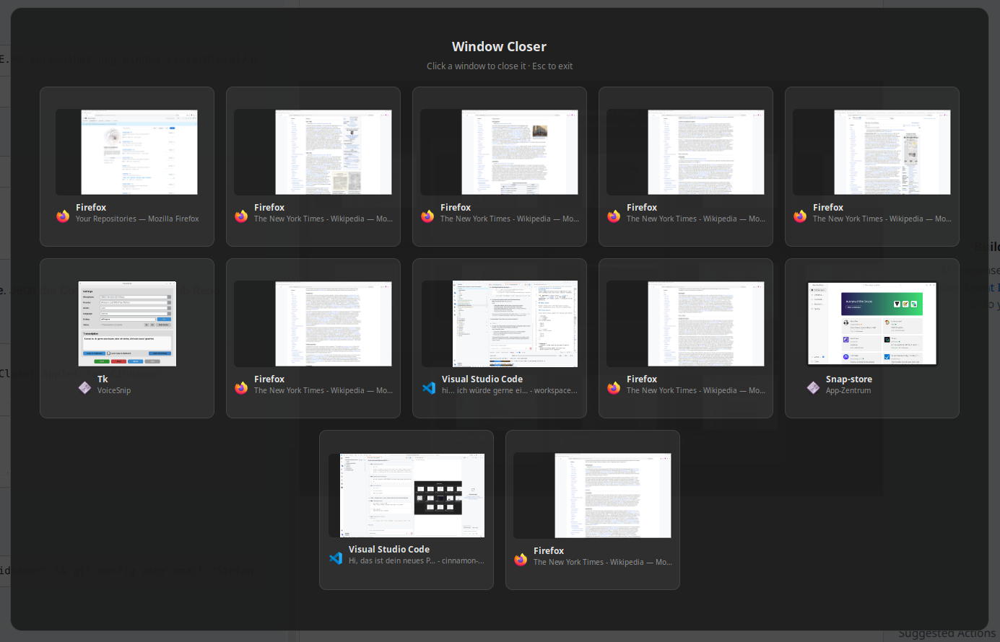

# Window Closer - Cinnamon Applet

A Cinnamon desktop applet that lets you quickly close multiple windows from a visual overview.



## Features

- Click the panel icon to open a fullscreen overlay with all open windows
- Each window is shown as a card with a **live thumbnail** preview, app icon, and title
- Click any card to **close that window** instantly
- The overlay stays open so you can close multiple windows in a row
- Cards turn red on hover to indicate which window will be closed
- Press **Esc** or click the dark background to dismiss the overlay

## Installation

```bash
cp -r window-closer@local ~/.local/share/cinnamon/applets/
```

Then reload Cinnamon (**Alt+F2** > type `r` > Enter) and activate the applet:
1. Right-click the Cinnamon panel
2. Select **Applets**
3. Find **Window Closer** and enable it

## Requirements

- Linux Mint / Ubuntu with **Cinnamon 6.x** desktop environment
- No external dependencies

## License

MIT License © 2026 Stefan Schmidbauer — see [LICENSE](LICENSE) for details. Built with [Claude Code](https://claude.ai/claude-code).
